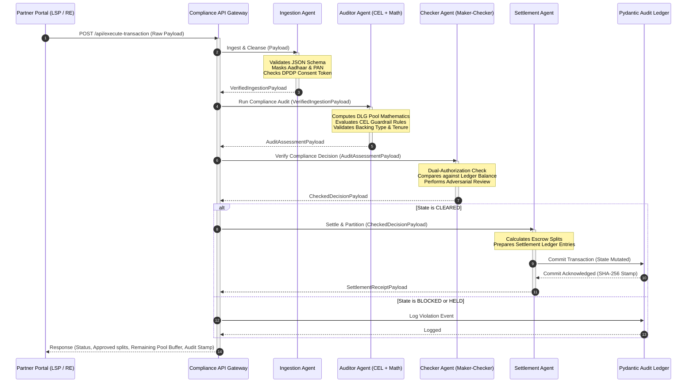

# ARCHITECTURE.md — RBI Default Loss Guarantee (DLG) Compliance Gate (ID 126)

This system design document details the architecture, multi-agent orchestration, compliance guardrails, inter-agent schemas, mathematical tracking engines, and Google Cloud integrations for the **RBI Digital Lending Default Loss Guarantee (DLG) Compliance Gate**.

---

## 1. Regulatory Context & Statutory Requirements

The Reserve Bank of India (RBI) issued guidelines on **Default Loss Guarantee (DLG) in Digital Lending** (circular *RBI/2023-24/41 DOR.CRE.REC.44/21.07.015/2023-24*) to regulate credit enhancement arrangements between Lending Service Providers (LSPs) and Regulated Entities (REs - Banks or NBFCs). 

This compliance gate enforces the following statutory constraints:

### A. The 5% Cap Limit on DLG Cover
* **Statutory Rule:** REs must ensure that the total DLG cover on any outstanding loan portfolio does not exceed **5.0%** of the total loan portfolio volume.
* **Pool Performance Tracking:** The gateway must track the cumulative DLG pool commitments, active loan portfolio volumes, outstanding balances, and historical claims to ensure the 5% cap is never breached during new onboarding or claim invocation.

### B. Eligible Forms of DLG
DLG arrangements can only be backed by:
1. **Cash Deposit** with the RE.
2. **Fixed Deposits** (FD) kept with Scheduled Commercial Banks (SCBs) lien-marked in favor of the RE.
3. **Bank Guarantees** in favor of the RE.
*Any other asset class proposed as DLG backing must be immediately blocked by the compliance gate.*

### C. DLG Tenure Matching
* **Statutory Rule:** The tenure of the DLG arrangement must match the tenure of the **longest loan** in the underlying portfolio.
* **Validation Rule:** The system compares the maturity date of the DLG instrument against the maximum maturity date of the loans under management.

### D. Escrow and Settlement Splits
* Loans disbursed must flow through dedicated escrow accounts.
* Recovery splits must be partitioned transparently. If co-lending is active, the principal/interest splits (e.g., 80:20 RE-NBFC) and DLG default recovery splits must be routed programmatically without touchpoints.

### E. Data Privacy (DPDP Act 2023)
* Strict isolation of PII (Aadhaar, PAN, contact numbers).
* Deterministic masking at the ingestion boundary with validation check stamps.

---

## 2. Multi-Agent System Architecture

The gate is designed as a **four-stage multi-agent pipeline** processing transactions sequentially in a secure state machine. Each agent performs specific statutory, risk, or mathematical checks, passing validated state packages to the next actor.

```
+------------------+     +------------------+     +------------------+     +--------------------+
|  IngestionAgent  | --> |   AuditorAgent   | --> |   CheckerAgent   | --> |  SettlementAgent   |
+------------------+     +------------------+     +------------------+     +--------------------+
  PII Masking &            Statutory CEL            Maker-Checker            Ledger Commit &
  Schema Validation        & Financial Math         Adversarial Audit        Escrow Waterfall
```

### A. Sequence Diagram



---

## 3. Inter-Agent Message Schemas

Communication between agents is strictly typed using Pydantic v2 schemas to ensure zero structural drift.

### A. Ingestion to Auditor: `VerifiedIngestionPayload`
```python
from pydantic import BaseModel, Field, field_validator
from typing import Literal, Optional
import re

class VerifiedIngestionPayload(BaseModel):
    transaction_id: str = Field(..., description="Unique transaction UUID")
    arrangement_id: str = Field(..., description="Reference ID for the DLG contract")
    lsp_id: str = Field(..., description="Lending Service Provider identifier")
    re_id: str = Field(..., description="Regulated Entity (Bank/NBFC) identifier")
    
    # Financial Fields
    total_portfolio_amount_inr: float = Field(..., description="Total loan portfolio size")
    current_loan_disbursement_inr: float = Field(..., description="Value of current loan being boarded")
    cumulative_dlg_payout_inr: float = Field(..., description="DLG amount already paid out historically")
    current_payout_requested_inr: float = Field(0.0, description="Current payout amount claimed under guarantee")
    
    # Collateral & Tenure Fields
    guarantee_backing_type: str = Field(..., description="E.g., CASH_DEPOSIT, FIXED_DEPOSIT, BANK_GUARANTEE")
    backing_secured_percentage: float = Field(..., description="Fraction of guarantee backed by collateral (1.0 = 100%)")
    longest_loan_tenure_months: int = Field(..., description="Maturity of the longest loan in the portfolio")
    dlg_arrangement_tenure_months: int = Field(..., description="Tenure of the DLG arrangement contract")
    
    # Masked PII (DPDP Compliant)
    borrower_consent_token: str = Field(..., description="DPDP Consent Verification Token")
    aadhaar_masked: str = Field(..., description="Masked Aadhaar (e.g., XXXXXXXX1234)")
    pan_masked: str = Field(..., description="Masked PAN (e.g., XXXXX1234X)")

    @field_validator('aadhaar_masked')
    @classmethod
    def check_aadhaar_mask(cls, v: str) -> str:
        if not re.match(r"^X{8}\d{4}$", v):
            raise ValueError("Aadhaar must be fully masked: 8 'X's and 4 suffix digits")
        return v

    @field_validator('pan_masked')
    @classmethod
    def check_pan_mask(cls, v: str) -> str:
        if not re.match(r"^X{5}\d{4}X$", v):
            raise ValueError("PAN must be fully masked: 5 'X's, 4 digits, 1 'X'")
        return v
```

### B. Auditor to Checker: `AuditAssessmentPayload`
```python
class AuditAssessmentPayload(BaseModel):
    ingested_data: VerifiedIngestionPayload
    
    # Calculated Math Metrics
    dlg_pool_limit_inr: float = Field(..., description="5.0% cap ceiling value")
    current_dlg_utilization_percentage: float = Field(..., description="Current utilization of the DLG pool")
    is_cap_exceeded: bool = Field(..., description="True if DLG requested + cumulative exceeds 5% limit")
    is_tenure_valid: bool = Field(..., description="True if DLG tenure matches/exceeds longest loan tenure")
    
    # Guardrail Outcomes
    cel_rules_evaluation: dict[str, bool] = Field(..., description="Individual CEL rule checks and outcomes")
    suggested_status: Literal["CLEARED", "BLOCKED"] = Field(...)
    violation_reasons: list[str] = Field(default_factory=list)
```

### C. Checker to Settlement: `CheckedDecisionPayload`
```python
class CheckedDecisionPayload(BaseModel):
    audit_assessment: AuditAssessmentPayload
    checker_id: str = Field(..., description="Checker Agent Identity Signature")
    double_entry_verified: bool = Field(..., description="Asserts ledger matches request totals")
    final_status: Literal["CLEARED", "BLOCKED", "HELD"] = Field(...)
    rejection_reasons: list[str] = Field(default_factory=list)
    adversarial_remarks: Optional[str] = Field(None, description="Gemini 3.5 Pro risk remarks")
```

### D. Settlement to Ledger: `SettlementReceiptPayload`
```python
class SettlementReceiptPayload(BaseModel):
    transaction_id: str
    arrangement_id: str
    final_status: str
    settled_payout_amount_inr: float
    remaining_dlg_buffer_inr: float
    escrow_splits: dict[str, float] = Field(..., description="Payout distributions (RE Share, LSP Share, Collateral Release)")
    audit_stamp: str = Field(..., description="SHA-256 verification hash of complete transaction state")
```

---

## 4. Mathematical Engine Equations

The core calculation framework tracking DLG pool sizing, allocations, splits, and compliance ratios.

### A. DLG Pool & Cap Assessment
Let:
* $V_P$ = Total loan portfolio volume.
* $C_{cap}$ = Statutory DLG Cap (exactly 0.05).
* $G_{max}$ = Maximum permissible DLG commitment amount.
* $G_{committed}$ = Current active DLG amount committed under contract.
* $P_{cum}$ = Cumulative DLG payouts already disbursed historically.
* $P_{req}$ = New payout claim requested.

The maximum permissible DLG commitment is defined by:
$$G_{max} = V_P \times C_{cap} = 0.05 \times V_P$$

To onboard a new guarantee commitment ($G_{new}$), the system enforces:
$$G_{committed} + G_{new} \le G_{max}$$

To clear a default loss payout request ($P_{req}$), the system calculates the remaining DLG buffer:
$$B_{dlg} = G_{max} - P_{cum}$$

The request is permitted if:
$$P_{req} \le B_{dlg}$$

### B. Utilization Metric
The active utilization rate $U_{pool}$ of the DLG pool is tracked as:
$$U_{pool} = \frac{P_{cum} + P_{req}}{G_{max}} \times 100$$

### C. Tenure Matching
Let $T_L = \{t_1, t_2, \dots, t_n\}$ be the tenures of all individual loans (in months) mapped in the portfolio, and $T_{DLG}$ be the tenure of the DLG instrument contract.
$$T_{DLG} \ge \max(T_L)$$

### D. Escrow Waterfall & Settlement Splits
In case of defaults settled under DLG where co-lending is active between RE (e.g., Bank, 80%) and partner NBFC (20%):
* Total Default Amount = $D_{total}$
* DLG Payout Claimed = $P_{req}$
* Recovered Default Splitting (after DLG invocation):
  - Let $R$ be the recovery amount collected post-default settlement.
  - The settlement splits are defined as:
$$S_{RE} = R \times 0.80$$
$$S_{LSP} = R \times 0.20$$
  - Once DLG is invoked, recoveries up to the value of $P_{req}$ are first routed back to replenish the DLG collateral pool (FD/Cash):
$$R_{replenish} = \min(R, P_{req})$$
$$R_{excess} = R - R_{replenish}$$

---

## 5. Statutory CEL Guardrails

Common Expression Language (CEL) provides fast, AST-validated, side-effect-free policy execution.

### A. 5% DLG Cap Enforcer (`REG_DLG_CAP`)
This rule validates that the requested payout or commitment fits within the statutory 5% cap limit.
```cel
// Validate that cumulative payouts + current request does not exceed 5% of total portfolio amount
(double(input.cumulative_dlg_payout_inr) + double(input.current_payout_requested_inr)) <= (0.05 * double(input.total_portfolio_amount_inr))
```

### B. PII Masking and DPDP Consent Check (`REG_DPDP_SAFETY`)
This rule enforces strict validation of DPDP consent and ensures no raw PII leaks into reasoning frameworks.
```cel
// Verify consent is active and Aadhaar & PAN are correctly masked
input.borrower_consent_token != "" 
&& matches(input.aadhaar_masked, "^X{8}\\d{4}$") 
&& matches(input.pan_masked, "^X{5}\\d{4}X$")
```

### C. Collateral Backing Type Check (`REG_DLG_BACKING`)
This rule restricts DLG contracts only to the three forms mandated by the RBI.
```cel
// Backing must be CASH_DEPOSIT, FIXED_DEPOSIT, or BANK_GUARANTEE, fully secured
input.guarantee_backing_type in ["CASH_DEPOSIT", "FIXED_DEPOSIT", "BANK_GUARANTEE"] 
&& input.backing_secured_percentage == 1.0
```

### D. DLG Tenure Compliance Check (`REG_DLG_TENURE`)
This rule ensures the DLG arrangement matches the tenure of the longest loan.
```cel
// DLG instrument tenure must be greater than or equal to the longest loan tenure
input.dlg_arrangement_tenure_months >= input.longest_loan_tenure_months
```

---

## 6. Pydantic Ledger Validation

To prevent tampering and ensure database integrity without complex infrastructure, the system implements a **Pydantic-based double-entry validation ledger** written as an append-only JSONL transaction stream (`audit_trace.jsonl`).

```
+-------------------------------------------------------+
|                 Pydantic Ledger Record                |
+-------------------------------------------------------+
| - Transaction ID (UUID)                               |
| - Timestamp                                           |
| - DLG Remaining Buffer Balance                        |
| - Running Cumulative Payout                           |
| - Calculated SHA-256 State Hash                       |
+-------------------------------------------------------+
                           |
                           v
        Verification: Current State + Delta
                           |
                           v
+-------------------------------------------------------+
|           SHA-256 Verification Checksum               |
|  hash(Previous Hash + Current Record JSON Payload)     |
+-------------------------------------------------------+
```

1. **State Isolation:** The Ledger Service loads historical records and validates state transitions.
2. **Cryptographic Chaining:** Each record contains an `audit_stamp` hash calculated as:
   $$\text{audit\_stamp}_i = \text{SHA256}(\text{audit\_stamp}_{i-1} + \text{RecordPayload}_i)$$
3. **Double-Entry Balance Check:** Every write triggers a balance check equation:
   $$\text{Buffer Balance} + \text{Cumulative Payouts} = \text{Initial Permissible Pool Amount}$$
   If any discrepancy is found, the Ledger rejects the write, and the Checker Agent marks the request `HELD` (escalated for manual audit).

---

## 7. Google Cloud Platform (GCP) Differentiators

The compliance gate leverages Google Cloud's AI and data capabilities:

### A. Gemini 3.5 Pro
* **Advanced Underwriting Reasoning:** When CEL guardrails are cleared, Gemini 3.5 Pro performs semantic analysis of contract disputes, loss rate accelerations, and macroeconomic indicators.
* **Cost-Controlled Invocation:** If CEL guardrails block a transaction, the pipeline stops immediately. No Vertex AI call is placed, optimizing latency and token costs.

### B. High-Speed Guardrail Processing
* **CEL Evaluation:** Executed directly in memory using standard AST parsers in less than 2ms, acting as a lightweight, zero-latency egress gate.

### C. Target Architecture Deployment
* **Cloud Spanner:** Used for transactional DLG ledger storage in multi-region deployments, eliminating double-spending risk on payout claims.
* **Vertex AI Agent Platform:** Simplifies agent routing, telemetry tracking, and integration with enterprise identity providers.
* **BigQuery:** Ingests the JSONL audit traces to perform portfolio-wide risk analytics, default rate projections, and compliance audits across millions of records.
